# 📊 CustomerCRUD UML Diagrams

This document contains comprehensive UML diagrams explaining the CustomerCRUD project architecture, flow, and components.

## 🏗️ System Architecture Diagram


## 🔄 Application Flow Diagram


## 📁 Class Diagram

```mermaid
classDiagram
    class Customer {
        +int id
        +string name
        +string email
        +string phone
        +datetime created_at
        +datetime updated_at
        
        +create() bool
        +update() bool
        +delete() bool
        +findById(id) Customer
        +findAll() Customer[]
        +emailExists(email) bool
    }
    
    class SimpleEmailService {
        -string apiKey
        -string fromEmail
        -SendGrid sendgrid
        
        +__construct(apiKey, fromEmail)
        +sendWelcomeEmail(customer) bool
        +sendUpdateNotification(customer) bool
        -prepareMail(to, subject, content) Mail
    }
    
    class DatabaseConfig {
        +string host
        +string dbname
        +string username
        +string password
        +PDO connection
        
        +getConnection() PDO
        +testConnection() bool
    }
    
    Customer ||--o{ SimpleEmailService : uses
    Customer ||--o{ DatabaseConfig : connects
    
    note for Customer "Main business entity\nHandles CRUD operations"
    note for SimpleEmailService "Handles email notifications\nvia SendGrid API"
    note for DatabaseConfig "Database connection\nmanagement"
```

## 🚀 Deployment Flow Diagram

```mermaid
graph LR
    subgraph "Development"
        Dev[Developer]
        LocalCode[Local Code Changes]
        GitCommit[Git Commit]
    end
    
    subgraph "GitHub"
        Repo[GitHub Repository]
        Actions[GitHub Actions]
        Pipeline[CI/CD Pipeline]
    end
    
    subgraph "Production Server"
        AutoDeploy[Auto-Deploy Script]
        Timer[SystemD Timer]
        Deploy[Deploy Script]
        Docker[Docker Compose]
        Live[Live Application]
    end
    
    Dev --> LocalCode
    LocalCode --> GitCommit
    GitCommit --> Repo
    Repo --> Actions
    Actions --> Pipeline
    
    Pipeline -->|Success| AutoDeploy
    Pipeline -->|Failure| X[❌ No Deployment]
    
    Timer -->|Every 5min| AutoDeploy
    AutoDeploy -->|Checks GitHub API| Pipeline
    AutoDeploy -->|New Success| Deploy
    Deploy --> Docker
    Docker --> Live
```



## 🗃️ Database Schema Diagram


## 🐳 Docker Architecture


## 🔄 Auto-Deployment State Diagram


## 📊 Component Diagram


## 🔍 Use Case Diagram


---

## 📝 Notes

- **Architecture**: Modern 3-tier architecture with Docker containerization
- **Security**: Environment-based configuration, input validation
- **Scalability**: Docker containers, stateless design
- **Reliability**: Auto-deployment with health checks, transaction safety
- **Maintainability**: Clean separation of concerns, comprehensive logging

## 🔗 References

- [README.md](README.md) - Project overview and setup
- [DEPLOYMENT.md](DEPLOYMENT.md) - Production deployment guide  
- [AUTO-DEPLOY-README.md](AUTO-DEPLOY-README.md) - Auto-deployment system